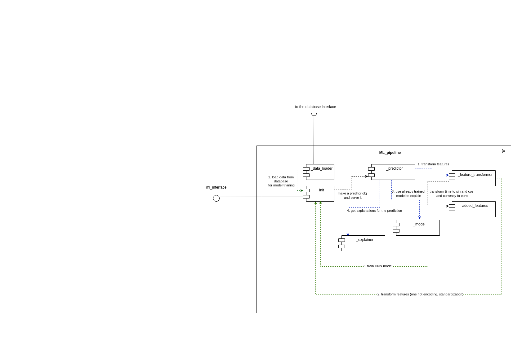
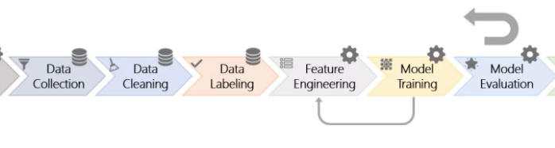

# System Component Diagram

# ML Pipeline Component Diagram

## ML Pipeline Description

It is best to describe the ML pipeline using examples:

- Example 1: A request comes from an admin to train a new model to the **dashboard** app. The admin has uploaded some data as well. The dashboard app first makes use of the gx (Great Expectation) framework and the script that was made for validating the data. Then the validated data is added to the database. Then the dashboard app calls on the make_model function in __init__ module, and it passes the date interval for which data should be included. The make_model function loads data from the database using the _data_loader module first. Then, it will run feature engineering on the data using the _feature_transformer module. Then the _model module is used for training the AI model. Finally the model is saved in a file, and the dashboard app takes care of saving the model in the database.

- Example 2: Now a request comes from a normal user for predicting if a transaction is fraudulent. Our app makes a predictor object every time a new model is deployed. If the model has not changed, we use the same predictor object and hence the same model. The predictor object first uses _feature_transformer to engineer the transaction at hand. Then, it will make use of the deployed model to make a prediction. Finally _explainer provides reasons for the prediction. The prediction, alongside the reasons, are sent back to the front-end.

As you can see, the code modules above and the order in which actions are taken in model training and prediction resembel the following part of the ML pipeline diagram:

