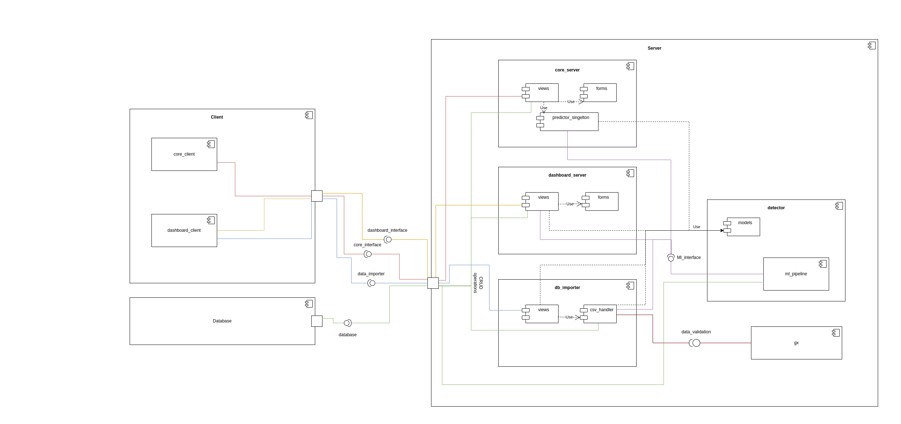
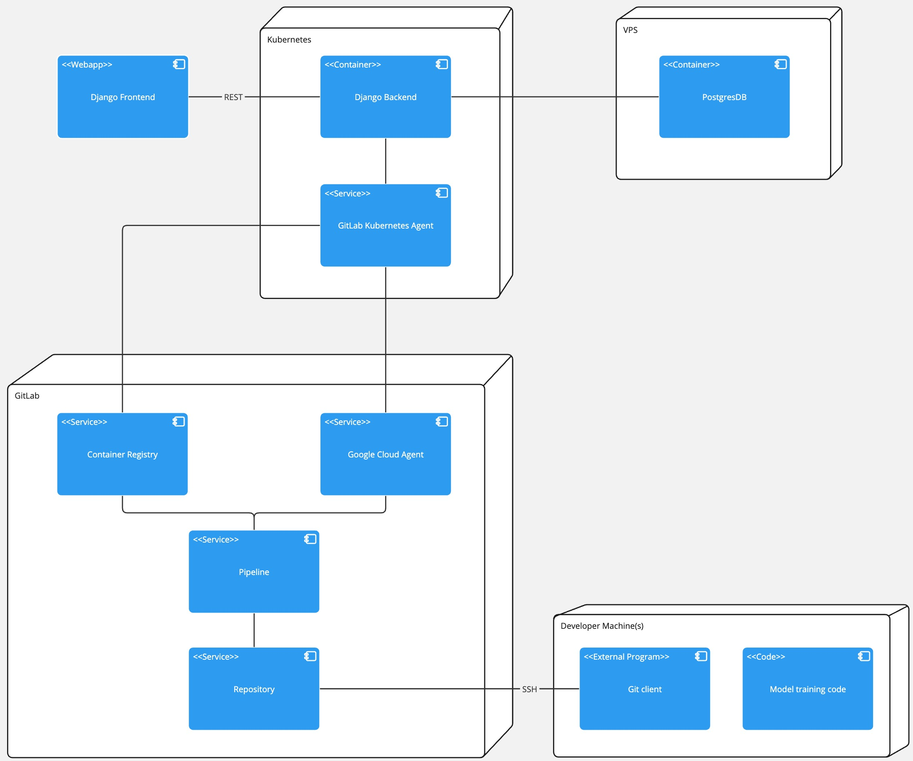

# Project Description

This project is an AI data intensive fraud detection application that relies on the power of **DNNs** to classify transactions as fraudulent or non-fraudulent based on the transactions features. The trained DNN model is availabe for use via a web application developed using the **Django** framework. The dockeried web application is also deployed on the **Google Cloud** platform using kubernetes. The ML pipeline is described in the **ML_pipeline_documentaion** file.

# Project Structure

The project is structured as follows:

- `README.md` - This file
- `ML_pipeline_documentaion.md` - Describes the ML pipeline
- `management.md` - Describes the project management process
- `assets` - Contains images and other assets
- `fraud_detection` - Contains the Django project
- `db_setup` - Contains the database setup. This was initially used for setting up the database on the VPS. However, everything is now handled by the Django app.
- `prototypes` - Contains the ML prototypes. This was initially used for training the AI and reaching the metrics desired.
- `.gitignore` - Contains files that should be ignored by git
- `.gitlab-ci.yml` - Contains the CI/CD pipeline
- `.gitlab` - Contains the gitlab templates for merge requests and issues
- `environment.yml` - Contains the packages required for the project
- `jupyter_requirements.txt` - Contains the packages required for running jupyter notebook
- `deployment.yml` - Contains the kubernetes deployment file
- `gx` - Contains the Great Expectation files used for data validation
- `.style.yapf` - Contains the yapf configuration file for auto formatting of the code

# Django Project Structure

The Django project is structured as follows:

- `fraud_detection` - Contains the Django project setup
- `core` - Contains the core application
- `detection` - Contains the detection application. the ML pipeline is in this application
- `Dashboard` - Contains the dashboard application used to manage the ML models by staff
- `db_importer` - Contains the db_importer application used to import data (in form of `csv`) into the database
- `dockerfile` - Contains the dockerfile for building the docker image
- `run.sh` - Contains the script for running the Django application both in development and production modes
- `manage.py` - The main entry to our application

# Project Arctitecture

We make use of a client/server architecture since we have a web application. Since we are using Django templates. We render `HTML` files. As a result we have server_side rendering and not a single page application. Here is a visual representation of the architecture in the form of a component diagram:



To get a full viw on the ML_pipeline, please refer to the `ML_pipeline_documentaion.md`

The deployment structure is as follows:



# Get Started

To get started with the project, you need to do the following steps:

1. You need to first fix the environment, to be able to run the application. You need to install `anaconda` or `miniconda` on your system. Please refer to [this website](https://docs.conda.io/projects/conda/en/latest/index.html) for more information.
2. After you have installed `anaconda` or `miniconda`, you need to run the following command:
```bash
# Make sure you are in the root directory of the project
conda env create -f environment.yml
```
1. Now you can run the application using the following command:
```bash
conda activate prj

cd fraud_detection

python3 manage.py runserver # For linux/mac
python manage.py runserver # For windows
```